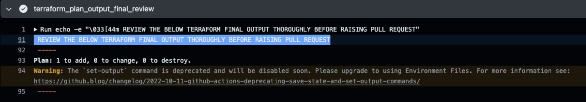

# github-actions-terraform-plan-output-checker

This repository code explains the below script:

How to extract terraform plan output and print only terraform plan output `Plan:` single line output.

Pre-requisite:
- Configure secrets in github repo setting with the name `GOOGLE_APPLICATION_CREDENTIALS`

Sample output:

